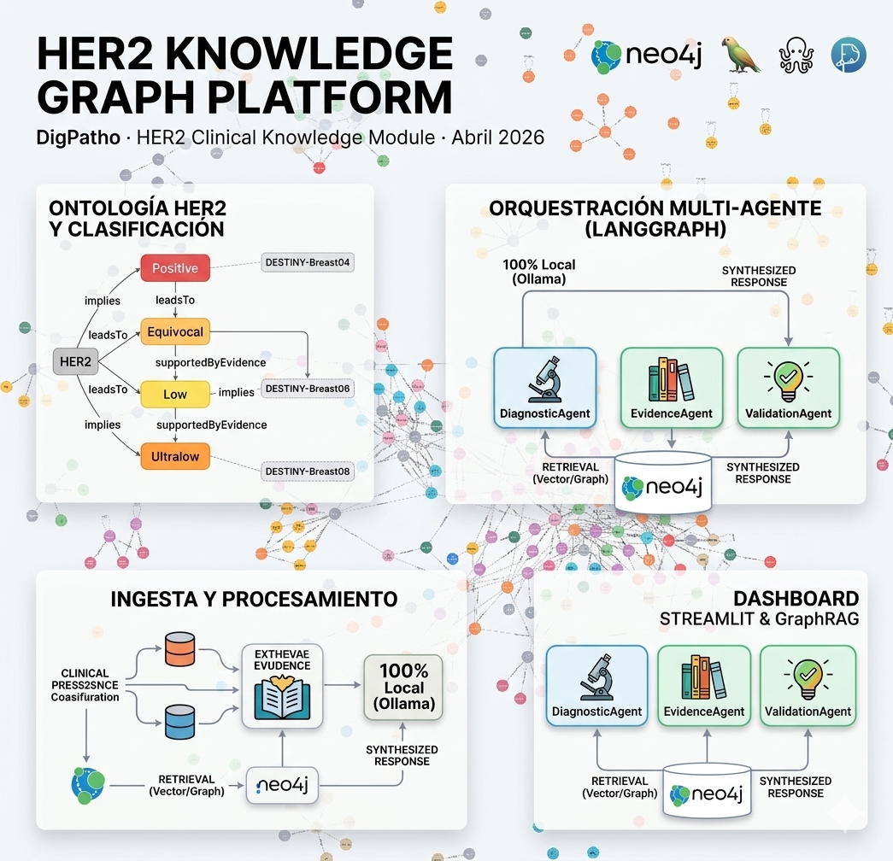
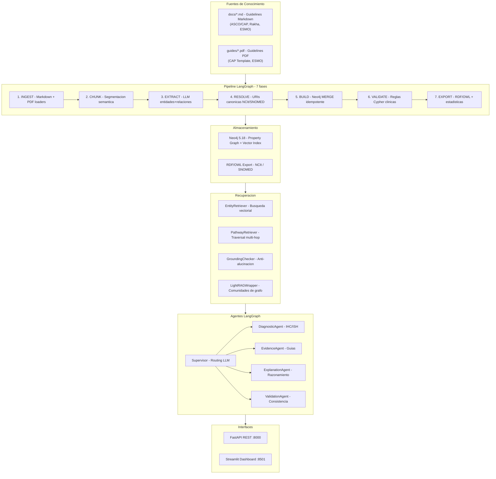
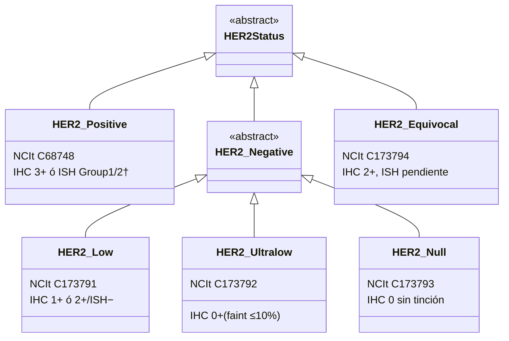
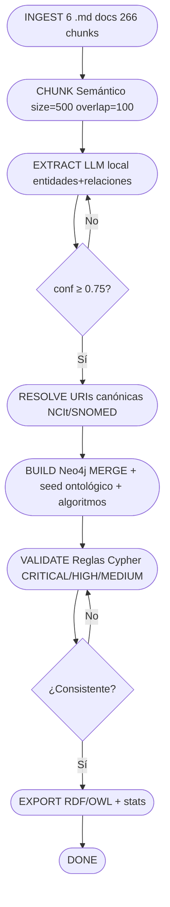
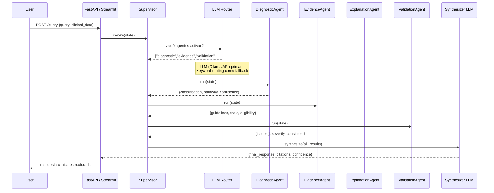
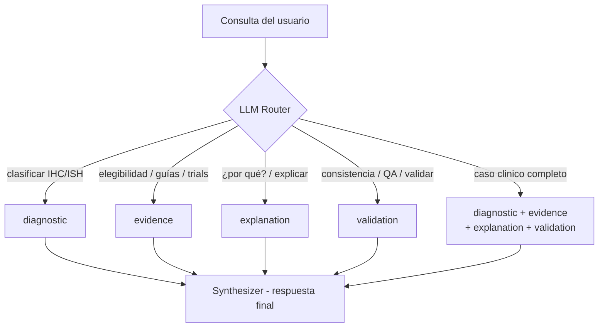
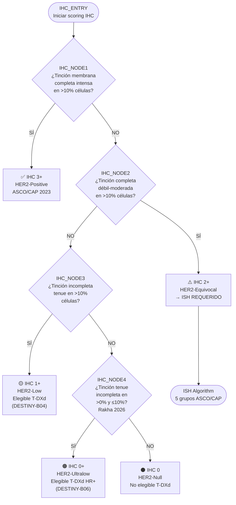

# HER2 Knowledge Graph Platform



**DigPatho · HER2 Clinical Knowledge Module · April 2026**

Plataforma de razonamiento diagnóstico HER2 de nivel productivo que combina un grafo de propiedades Neo4j, orquestación multi-agente con LangGraph, e inferencia LLM local vía Ollama.

---

## Características

- **Continuo HER2 de cinco categorías** — Positivo / Equívoco / Low / Ultralow / Null (ASCO/CAP 2023 + Rakha 2026)
- **Clasificación determinista** — Motor de reglas IHC/ISH, sin LLM requerido
- **Pipeline LLM idempotente** — Extracción de entidades y relaciones con `MERGE`, seguro de re-ejecutar
- **Multi-agente LangGraph** — DiagnosticAgent, EvidenceAgent, ExplanationAgent, ValidationAgent orquestados por un Supervisor
- **GraphRAG retrieval** — Índice vectorial Neo4j + traversal de pathways
- **Grounding anti-alucinación** — Validación post-generación de respuestas LLM contra el KG
- **Streamlit dashboard** — Simulador de casos, visor de pathways, interfaz de consulta
- **FastAPI REST API** — Acceso programático a todas las capacidades de razonamiento clínico
- **100% local** — Corre on-premises con Ollama (qwen3:8b, ministral-3:8b, gemma4:e4b, nomic-embed-text)

---

## Tabla de Contenidos

- [Arquitectura de Sistema](#arquitectura-de-sistema)
- [Ontología HER2](#ontología-her2)
- [Pipeline de Construcción del KG](#pipeline-de-construcción-del-kg)
- [Sistema Multi-Agente](#sistema-multi-agente)
- [Árbol de Decisión Diagnóstico](#árbol-de-decisión-diagnóstico)
- [Quick Start](#quick-start)
- [Deployment](#deployment)
- [Referencia de API](#referencia-de-api)
- [Estructura del Proyecto](#estructura-del-proyecto)
- [Categorías HER2](#categorías-her2)
- [Variables de Entorno](#variables-de-entorno)
- [Desarrollo y Tests](#desarrollo-y-tests)

---

## Arquitectura de Sistema



---

## Ontología HER2

### Jerarquía de Clases (Annex A)



### Predicados del Grafo

| Predicado                    | Sujeto → Objeto                         | Ejemplo                                   |
| ---------------------------- | ---------------------------------------- | ----------------------------------------- |
| `implies`                  | IHCScore/ISHGroup → ClinicalCategory    | Score3Plus → HER2_Positive               |
| `requiresReflexTest`       | IHCScore → Assay                        | Score2Plus → ISH                         |
| `impliesIfISHAmplified`    | IHCScore → ClinicalCategory             | Score2Plus → HER2_Positive (ISH+)        |
| `impliesIfISHNonAmplified` | IHCScore → ClinicalCategory             | Score2Plus → HER2_Low (ISH−)            |
| `requiresIHCWorkup`        | ISHGroup → ClinicalCategory             | Group2 → HER2_Equivocal                  |
| `eligibleFor`              | ClinicalCategory → TherapeuticAgent     | HER2_Low → T-DXd                         |
| `notEligibleFor`           | ClinicalCategory → TherapeuticAgent     | HER2_Null → T-DXd                        |
| `definedIn`                | Entity → Guideline/ClinicalTrial        | HER2_Ultralow → DESTINY_Breast06         |
| `supportedByEvidence`      | Entity → ClinicalTrial                  | HER2_Low → DESTINY_Breast04              |
| `proposedCorrelation`      | FractalMetric → ClinicalCategory        | FractalDimension_D0>1.85 → HER2_Positive |
| `leadsTo`                  | DiagnosticDecision → DiagnosticDecision | IHC_NODE2 → ISH_NODE_ENTRY               |
| `overrides`                | new Guideline → old Guideline           | Rakha_2026 → ASCO_CAP_2018               |
| `hasThreshold`             | ISHGroup/Decision → Threshold           | Group1 → ratio≥2.0                      |

### Métricas Fractales DigPatho

| Métrica            | Categoría HER2 | Rango Propuesto |
| ------------------- | --------------- | --------------- |
| FractalDimension D0 | HER2-Positive   | > 1.85          |
| FractalDimension D0 | HER2-Low        | 1.50 – 1.65    |
| FractalDimension D0 | HER2-Equivocal  | 1.60 – 1.85    |
| FractalDimension D0 | HER2-Ultralow   | 1.35 – 1.50    |
| Lacunaridad         | HER2-Positive   | < 0.10          |
| MultifractalSpread  | HER2-Positive   | > 0.40          |

> ⚠️ Las correlaciones fractales son **hipótesis experimentales** (`proposedCorrelation`, confidence ≤ 0.70), no criterios diagnósticos validados.

---

## Pipeline de Construcción del KG

### Fases del Pipeline



### Tipos de Chunks y Estrategia

| Tipo                | Estrategia                       | Ejemplos               |
| ------------------- | -------------------------------- | ---------------------- |
| `algorithm`       | Preservar íntegro (no dividir)  | Árbol IHC, ISH Groups |
| `criteria`        | Preservar íntegro               | Tablas ASCO/CAP        |
| `table`           | Extraer como JSON estructurado   | Rakha scoring matrix   |
| `general`         | Sliding window 500/100 tokens    | Texto de guías        |
| `qa`              | Preservar par completo           | Q&A clínicos          |
| `fractal_mapping` | Preservar íntegro               | Tabla D0/Lacunaridad   |
| `recommendation`  | Preservar sección               | Recomendaciones ESMO   |
| `ontology`        | **Omitir extracción LLM** | Código Turtle/OWL     |

### Configuración del LLM (`.env`)

```bash
HER2_KG_LLM_MODE=ollama          # claude | openai | ollama
HER2_KG_OLLAMA_MODEL=ministral-3:8b
HER2_KG_EMBEDDING_MODE=ollama
OLLAMA_BASE_URL=http://localhost:11434

# Neo4j
NEO4J_URI=bolt://localhost:7687
NEO4J_USERNAME=neo4j
NEO4J_PASSWORD=password
```

### Modelos Ollama Disponibles y Uso

| Modelo               | Parámetros | VRAM   | Uso recomendado                            |
| -------------------- | ----------- | ------ | ------------------------------------------ |
| `ministral-3:8b`   | 8.9B Q4_K_M | 7.5 GB | Extracción KG (production local)          |
| `qwen3:8b`         | 8.2B Q4_K_M | 5.9 GB | Rápido, requiere `format=json`          |
| `gemma4:e4b`       | 8.0B Q4_K_M | 5.9 GB | Alto razonamiento (thinking mode lento)    |
| `nomic-embed-text` | —          | 274 MB | Embeddings (obligatorio para vector index) |

### Re-ejecución del Pipeline

El pipeline usa `MERGE` en todas las escrituras a Neo4j — es **idempotente**. Re-ejecutarlo sobre un grafo existente actualiza propiedades sin duplicar nodos ni relaciones. Para partir desde cero ejecutar en Neo4j Browser:

```cypher
MATCH (n) DETACH DELETE n
```

---

## Sistema Multi-Agente



### Roles de los Agentes

| Agente                     | Herramientas                                   | Responsabilidad                                                   |
| -------------------------- | ---------------------------------------------- | ----------------------------------------------------------------- |
| **DiagnosticAgent**  | `traverse_decision_tree`, `execute_cypher` | Clasificación determinista IHC/ISH, pathway de decisión         |
| **EvidenceAgent**    | `get_entity_context`, `retrieve_pathway`   | Evidencia de guías, elegibilidad terapéutica, ensayos clínicos |
| **ExplanationAgent** | `get_entity_context`, LLM                    | Cadenas de razonamiento narrativas, "¿por qué?"                 |
| **ValidationAgent**  | `execute_cypher`, reglas Cypher              | Detección de inconsistencias, reglas ASCO/CAP                    |
| **Supervisor**       | LLM router + LangGraph                         | Orquestación, routing, síntesis final                           |

### Lógica de Routing



---

## Árbol de Decisión Diagnóstico

### IHC Algorithm (ASCO/CAP 2023 + Rakha 2026)



### ISH Groups (ASCO/CAP 2023)

| Grupo ISH         | HER2/CEP17 ratio | HER2 señales/cel | Clasificación      | Acción                 |
| ----------------- | ---------------- | ----------------- | ------------------- | ----------------------- |
| **Group 1** | ≥ 2.0           | ≥ 4.0            | HER2-Positive       | —                      |
| **Group 2** | ≥ 2.0           | < 4.0             | Equívoco → IHC    | Correlacionar con IHC   |
| **Group 3** | < 2.0            | ≥ 6.0            | Equívoco → workup | Reconteo + correlación |
| **Group 4** | < 2.0            | ≥ 4.0 y < 6.0    | Equívoco → IHC    | Correlacionar con IHC   |
| **Group 5** | < 2.0            | < 4.0             | HER2-Low            | —                      |

| Combinación especial | Resultado                 |
| --------------------- | ------------------------- |
| Group 2 + IHC 3+      | HER2-Positive (Comment-A) |
| Group 3/4 + IHC 3+    | HER2-Positive (Comment-A) |
| Group 3/4 + IHC 1+/2+ | HER2-Negative             |

---

## Quick Start

### Prerequisitos

- Python 3.11+
- [Ollama](https://ollama.ai) corriendo localmente
- Docker Desktop (para Neo4j en contenedor)

```bash
# Descargar modelos requeridos
ollama pull ministral-3:8b
ollama pull nomic-embed-text

# Opcionales (alternativas de extracción)
ollama pull qwen3:8b
ollama pull gemma4:e4b

# Instalar dependencias Python
pip install -r requirements.txt
```

### Opción A — Docker Compose (recomendado)

```bash
docker compose up -d

# Servicios disponibles:
# Neo4j Browser:   http://localhost:7474  (neo4j / password)
# FastAPI docs:    http://localhost:8000/docs
# Streamlit:       http://localhost:8501
```

### Opción B — Solo seed (sin LLM, instantáneo)

```bash
# Carga el grafo ontológico base (nodos, relaciones, algoritmos) sin extracción LLM
python -m app.cli seed-only
# → http://localhost:7474  MATCH (n) RETURN n LIMIT 80
```

### Opción C — Pipeline completo con LLM local

```bash
# Extrae entidades y relaciones de los 6 documentos en docs/
python -m app.cli run-pipeline --llm-mode ollama

# El pipeline es idempotente: re-ejecutar agrega/actualiza sin duplicar
```

### Demo de Agentes (sin Neo4j)

```bash
# Caso individual
python demo_agents.py --case diagnostic_3plus
python demo_agents.py --case diagnostic_2plus_ish3
python demo_agents.py --case diagnostic_ultralow
python demo_agents.py --case validation_conflict

# Supervisor multi-agente
python demo_agents.py --supervisor \
  --query "IHC 2+, ISH ratio 1.7, Group 3 — clasificar y verificar elegibilidad T-DXd" \
  --ihc "2+" --ish-group "Group3"

# Todos los casos predefinidos
python demo_agents.py --all
```

### Streamlit Dashboard

```bash
streamlit run app/streamlit_app.py
# → http://localhost:8501
```

### FastAPI Server

```bash
uvicorn app.api:app --reload --port 8000
# → http://localhost:8000/docs  (Swagger UI interactivo)
```

---

## Deployment

### Entornos soportados

| Entorno                       | Neo4j          | LLM / Embeddings    | Archivo base   |
| ----------------------------- | -------------- | ------------------- | -------------- |
| **Local (desarrollo)**  | Docker Compose | Ollama (local/free) | `.env.local` |
| **Cloud (producción)** | Neo4j AuraDB   | OpenAI API          | `.env`       |
| **Cloud (alternativa)** | Neo4j AuraDB   | Anthropic Claude    | `.env`       |

### Desarrollo local (Docker + Ollama)

```bash
# 1. Copiar plantilla de configuración
Copy-Item .env.local .env    # Windows
# cp .env.local .env         # Linux/macOS

# 2. Levantar Neo4j local
docker compose up -d neo4j

# 3. Descargar modelos Ollama (una sola vez)
ollama pull qwen3:8b
ollama pull nomic-embed-text

# 4. Poblar el grafo
python -m app.cli run-pipeline --llm-mode ollama
```

### Producción en la nube (AuraDB + OpenAI → Streamlit Cloud)

```bash
# 1. Configurar .env con credenciales de AuraDB y OpenAI:
#    NEO4J_URI=neo4j+s://<id>.databases.neo4j.io
#    NEO4J_USERNAME=<id>
#    NEO4J_PASSWORD=<password>
#    HER2_KG_LLM_MODE=openai
#    HER2_KG_EMBEDDING_MODE=openai
#    OPENAI_API_KEY=sk-...

# 2. Poblar AuraDB (idempotente — seguro re-ejecutar)
python -m app.cli run-pipeline --llm-mode openai

# 3. Verificar en AuraDB Browser
#    MATCH (n) RETURN count(n)   → ~460 nodos esperados
```

> **Streamlit Cloud:** configura las mismas variables de entorno en *Settings → Secrets* de tu app, y apunta el archivo principal a `app/streamlit_app.py`.

### Sincronización local ↔ AuraDB

El pipeline escribe todas las entidades con `MERGE` (idempotente). Para cambiar de entorno:

```powershell
# → Apuntar a local
Copy-Item .env.local .env
python -m app.cli run-pipeline --llm-mode ollama

# → Apuntar a AuraDB
# (editar .env manualmente o mantener .env.cloud con las credenciales)
python -m app.cli run-pipeline --llm-mode openai
```

Para exportar el grafo local a RDF y sincronizar AuraDB en un solo paso:

```bash
# Exporta output/her2_knowledge_graph_<timestamp>.ttl y .jsonld
# y siembra AuraDB con el grafo ontológico corregido (idempotente)
python scripts/export_and_sync_aura.py
```

> El script lee las credenciales de AuraDB directamente desde `.env`, independientemente de las variables de entorno del shell.

Para limpiar el grafo antes de una re-carga completa:

```cypher
-- Neo4j Browser / Cypher Shell
MATCH (n) DETACH DELETE n
```

> ⚠️ No ejecutes `DETACH DELETE` en producción (AuraDB) sin hacer backup primero.

---

## Referencia de API

| Método  | Endpoint                 | Descripción                               |
| -------- | ------------------------ | ------------------------------------------ |
| `GET`  | `/health`              | Liveness probe                             |
| `POST` | `/diagnose`            | IHC/ISH → clasificación HER2 + pathway   |
| `POST` | `/query`               | Lenguaje natural → respuesta multi-agente |
| `POST` | `/validate`            | Verificación de consistencia clínica     |
| `GET`  | `/evidence/{category}` | Elegibilidad terapéutica por categoría   |
| `GET`  | `/stats`               | Conteo de nodos y relaciones en el KG      |

> **Conversaciones multi-turn:** el endpoint `/query` acepta un campo opcional `thread_id`. Si se reutiliza el mismo `thread_id`, el estado de la conversación se recupera automáticamente desde `output/checkpoints.db` (SQLite). Omitir `thread_id` genera un UUID privado por solicitud.

### Ejemplos

#### Clasificar un caso

```bash
curl -X POST http://localhost:8000/diagnose \
  -H "Content-Type: application/json" \
  -d '{"ihc_score": "2+", "ish_group": "Group3", "ish_ratio": 1.7}'
```

```json
{
  "classification": "HER2_Equivocal",
  "confidence": "MEDIUM",
  "guideline": "ASCO_CAP_2023",
  "action": "Group 3 workup: correlate with IHC and recount per ASCO/CAP Comment-A",
  "pathway": "IHC_ENTRY → IHC_NODE1 → NO → IHC_NODE2 → YES → ISH_NODE_G3_ENTRY"
}
```

#### Consulta en lenguaje natural

```bash
curl -X POST http://localhost:8000/query \
  -H "Content-Type: application/json" \
  -d '{"query": "Is T-DXd approved for HER2-ultralow HR+ metastatic breast cancer?"}'
```

```json
{
  "final_response": "## Summary\nT-DXd (trastuzumab deruxtecan) is approved for HER2-ultralow...",
  "citations": [{"trial": "DESTINY-Breast06", "year": 2024}],
  "confidence": 0.92,
  "agents_invoked": ["evidence", "explanation"]
}
```

---

## Estructura del Proyecto

```
KnowledgeGraphHER2/
│
├── app/
│   ├── cli.py                  # CLI (run-pipeline, seed-only, validate, stats)
│   ├── api.py                  # FastAPI REST — 6 endpoints
│   └── streamlit_app.py        # Dashboard interactivo
│
├── src/
│   ├── domain/
│   │   ├── models.py           # Pydantic: DocumentChunk, ExtractionResult, ValidationReport…
│   │   ├── ontology.py         # URIs canónicas NCIt/SNOMED, SEED_ENTITIES, SEED_RELATIONS
│   │   ├── validation_rules.py # 15+ reglas Cypher CRITICAL/HIGH/MEDIUM
│   │   └── algorithm_definitions.py   # Árboles IHC + ISH como estructuras de datos
│   │
│   ├── ingestion/
│   │   ├── markdown_loader.py  # Carga .md con metadata y tipo de sección
│   │   └── pdf_loader.py       # PyMuPDF — PDFs en guides/
│   │
│   ├── extraction/
│   │   ├── entity_extractor.py # Prompt few-shot + parser JSON, limpia <think>
│   │   ├── resolution.py       # Resolución de URIs y alias
│   │   └── algorithm_parser.py # Convierte bloques algoritmo a nodos DiagnosticDecision
│   │
│   ├── graph/
│   │   ├── neo4j_builder.py    # MERGE idempotente — nodos, relaciones, chunks, algorithms
│   │   ├── vector_indexer.py   # Índice vectorial Neo4j (nomic-embed-text)
│   │   ├── validator.py        # Ejecuta validation_rules.py contra el KG
│   │   └── rdf_exporter.py     # Serializa a Turtle/RDF con rdflib
│   │
│   ├── retrieval/
│   │   ├── entity_retriever.py    # Búsqueda vectorial + keyword en Neo4j
│   │   ├── pathway_retriever.py   # Traversal multi-hop de algoritmos
│   │   ├── grounding.py           # GroundingChecker: pre/post-generación anti-alucinación
│   │   └── lightrag_wrapper.py    # Wrapper LightRAG para recuperación por comunidades
│   │
│   ├── agents/
│   │   ├── state.py            # HER2AgentState TypedDict (shared LangGraph state)
│   │   ├── tools.py            # LangChain tools: execute_cypher, traverse_decision_tree…
│   │   ├── diagnostic_agent.py # Clasificación determinista + narrativa LLM
│   │   ├── evidence_agent.py   # Guías, trials, elegibilidad terapéutica
│   │   ├── explanation_agent.py # Razonamiento narrativo y cadenas de por-qué
│   │   ├── validation_agent.py # Reglas de consistencia clínica
│   │   └── supervisor.py       # LangGraph: routing LLM + síntesis final
│   │
│   └── pipeline/
│       ├── kg_pipeline.py      # Grafo LangGraph de 7 fases (PipelineState TypedDict)
│       └── config.py           # PipelineConfig Pydantic — ollama/openai/claude
│
├── tests/
│   ├── test_domain.py          # 11 tests — modelos y ontología
│   ├── test_ingestion.py       # 9 tests  — loaders
│   ├── test_resolution.py      # 8 tests  — resolución de URIs
│   ├── test_extraction.py      # 16 tests — extractor + parser
│   ├── test_agents.py          # 25 tests — agentes y supervisor
│   ├── test_api.py             # 35 tests — endpoints FastAPI
│   └── test_integration.py     # 7 tests  — integración Neo4j (seed, validación)
│
├── docs/                       # Fuentes clínicas Markdown (6 archivos)
│   ├── annex_guidelines.md     # Criterios IHC integrados (todas las guías)
│   ├── annex_ontology.md       # Ontología OWL/RDF con métricas fractales
│   ├── her2_kg_pipeline_guide.md
│   ├── apendice_estado_del_arte_2025.md
│   ├── apendice_frameworks_graphrag.md
│   └── apendice_langchain_langgraph.md
│
├── guides/                     # PDFs de guías clínicas
├── output/                     # Salidas del pipeline: RDF/Turtle, JSON-LD, logs
├── config/prompts/             # Prompts de sistema
├── scripts/
│   ├── export_and_sync_aura.py # Exporta grafo local a RDF + siembra AuraDB
│   ├── compute_embeddings.py   # Genera embeddings vectoriales en Neo4j
│   ├── recreate_indexes.py     # Recrea índices vectoriales
│   └── check_mentions.py       # Verifica menciones y coherencia de entidades
├── her2_lightrag/              # Índice LightRAG persistente (generado al correr pipeline)
│
├── demo_agents.py              # Demo script — casos predefinidos
├── docker-compose.yml          # Neo4j + API + Streamlit
├── Dockerfile                  # python:3.11-slim, deps en requirements.txt
├── pyproject.toml              # her2-knowledge-graph v2.0.0, ruff, pytest
└── .env                        # Configuración local (no commitear)
```

---

## Categorías HER2

| Categoría               | Criterio IHC                         | ISH               | Elegible T-DXd                                | Guía         |
| ------------------------ | ------------------------------------ | ----------------- | --------------------------------------------- | ------------- |
| **HER2-Positive**  | 3+ completo intenso >10%             | — ó Group 1/2† | ✅ 2L+ (trastuzumab-based)                    | ASCO/CAP 2023 |
| **HER2-Equivocal** | 2+ completo débil-mod >10%          | ISH pendiente     | Pendiente ISH                                 | ASCO/CAP 2023 |
| **HER2-Low**       | 1+ incompleto tenue >10% ó 2+/ISH− | Group 5           | ✅ DESTINY-B04 (Modi 2022)                    | ASCO/CAP 2023 |
| **HER2-Ultralow**  | 0+ faint incompleto >0%–≤10%       | —                | ⚠️ HR+ solamente (DESTINY-B06, Bardia 2024) | Rakha 2026    |
| **HER2-Null**      | 0 sin tinción                       | —                | ❌                                            | ASCO/CAP 2023 |

†Group 2 con IHC 3+ concurrente → Positivo per Comment-A (ASCO/CAP 2023)

### Guías Clínicas Integradas

| Guía               | Año | Aportación principal                                 |
| ------------------- | ---- | ----------------------------------------------------- |
| ASCO/CAP            | 2023 | Criterios IHC revisados, ISH grupos 1–5, HER2-Low    |
| CAP Biomarker       | 2025 | Template de reporte, criterios IHC 0+, requisitos QA  |
| Rakha International | 2026 | Formalización HER2-Ultralow, scoring matrix revisado |
| ESMO                | 2023 | Recomendaciones terapéuticas 1L/2L metastásico      |

---

## Variables de Entorno

### Pipeline KG

| Variable                    | Default                    | Descripción                                         |
| --------------------------- | -------------------------- | ---------------------------------------------------- |
| `HER2_KG_LLM_MODE`        | `ollama`                 | Proveedor LLM:`ollama` \| `openai` \| `claude` |
| `HER2_KG_OLLAMA_MODEL`    | `ministral-3:8b`         | Modelo Ollama para extracción                       |
| `HER2_KG_EMBEDDING_MODE`  | `ollama`                 | Modo embeddings:`ollama` \| `openai`             |
| `HER2_KG_EMBEDDING_MODEL` | `nomic-embed-text`       | Modelo de embeddings                                 |
| `OLLAMA_BASE_URL`         | `http://localhost:11434` | URL servidor Ollama                                  |
| `HER2_KG_DOCS_DIR`        | `./docs`                 | Directorio de documentos Markdown                    |
| `HER2_KG_GUIDES_DIR`      | `./guides`               | Directorio de PDFs                                   |
| `HER2_KG_OUTPUT_DIR`      | `./output`               | Directorio de salidas                                |

### Neo4j

| Variable           | Local (Docker)            | Cloud (AuraDB)                        | Descripción      |
| ------------------ | ------------------------- | ------------------------------------- | ----------------- |
| `NEO4J_URI`      | `bolt://localhost:7687` | `neo4j+s://<id>.databases.neo4j.io` | URI de conexión  |
| `NEO4J_USERNAME` | `neo4j`                 | `<id>`                              | Usuario Neo4j     |
| `NEO4J_PASSWORD` | `password`              | `<password AuraDB>`                 | Contraseña Neo4j |
| `NEO4J_DATABASE` | *(vacío)*              | `<id>`                              | Base de datos     |

### API / Docker

| Variable        | Default                               | Descripción                     |
| --------------- | ------------------------------------- | -------------------------------- |
| `LLM_MODEL`   | `ministral-3:8b`                    | Modelo para la API REST          |
| `EMBED_MODEL` | `nomic-embed-text`                  | Modelo de embeddings para la API |
| `OLLAMA_HOST` | `http://host.docker.internal:11434` | URL Ollama desde Docker          |

### APIs Externas (opcionales)

| Variable              | Descripción                                  |
| --------------------- | --------------------------------------------- |
| `ANTHROPIC_API_KEY` | Claude Sonnet para extracción en producción |
| `OPENAI_API_KEY`    | GPT-4o-mini como alternativa                  |
| `LANGCHAIN_API_KEY` | LangSmith — observabilidad de agentes        |

---

## Desarrollo y Tests

```bash
# Suite completa (111 tests)
pytest -v

# Por módulo
pytest tests/test_domain.py -v       # 11 tests — modelos y ontología
pytest tests/test_agents.py -v       # 25 tests — agentes
pytest tests/test_api.py -v          # 35 tests — API endpoints
pytest tests/test_integration.py -v  # 7 tests  — integración Neo4j

# Lint y formato
ruff check src/ app/ tests/
ruff format src/ app/ tests/

# CLI — Comandos disponibles
python -m app.cli run-pipeline --llm-mode ollama   # Pipeline completo LLM
python -m app.cli seed-only                         # Solo ontología base (sin LLM)
python -m app.cli validate                          # Reglas de consistencia sobre KG actual
python -m app.cli stats                             # Estadísticas: nodos y relaciones
```

### Consultas Cypher Útiles

```cypher
-- Ver todas las categorías clínicas y sus relaciones
MATCH (c:ClinicalCategory)-[r]->(t) RETURN c.label, type(r), t.label LIMIT 30

-- Ver el árbol IHC completo
MATCH p=(d:DiagnosticDecision)-[:leadsTo*]->(r)
WHERE d.id = 'IHC_ENTRY'
RETURN p

-- Verificar elegibilidad T-DXd
MATCH (c:ClinicalCategory)-[:eligibleFor]->(t:TherapeuticAgent)
WHERE t.label CONTAINS 'Deruxtecan'
RETURN c.label, t.label

-- Estadísticas del grafo
MATCH (n) RETURN labels(n)[0] AS tipo, count(n) AS cantidad
ORDER BY cantidad DESC
```

---

## Licencia

MIT — DigPatho Research Group, 2026

---

## License

MIT — See [LICENSE](LICENSE)
