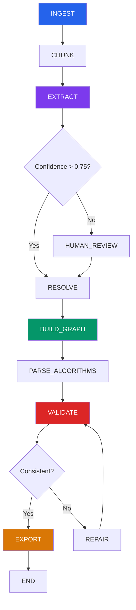
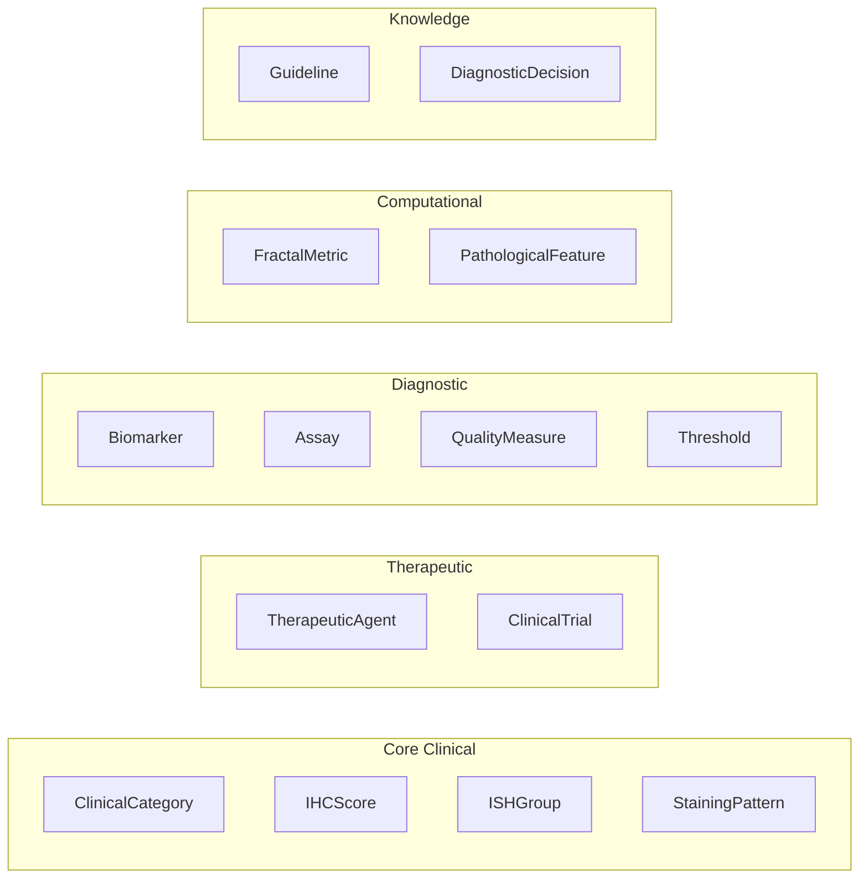
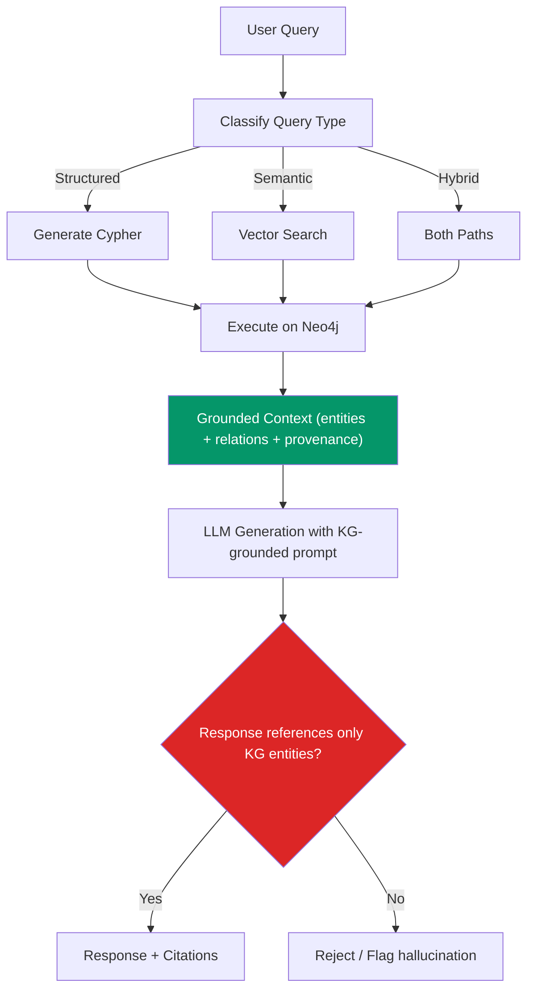
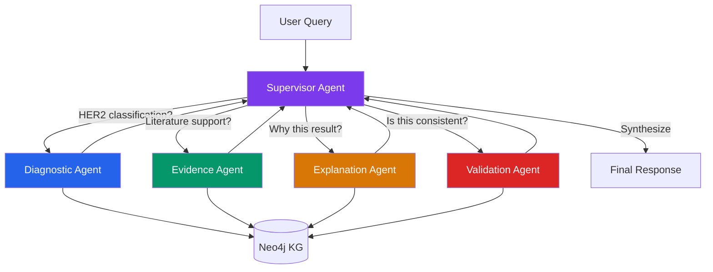
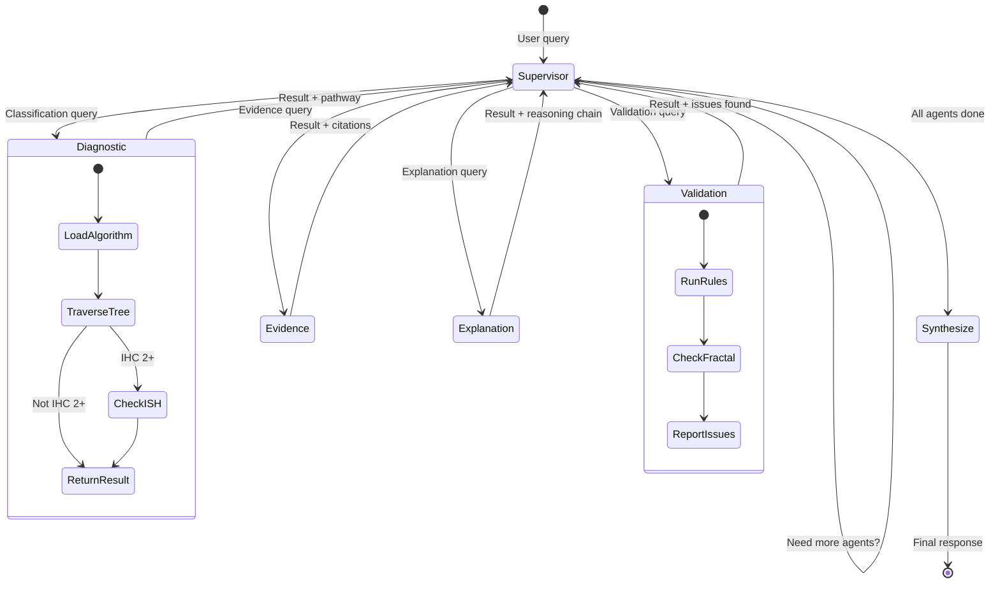
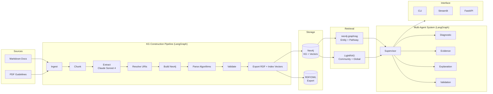

# HER2 Knowledge Graph — Complete Implementation Plan

**Project:** DigPatho – HER2 Clinical Knowledge Module
**Version:** 2.0 (supersedes `her2_kg_pipeline_guide.md` v1.0)
**Date:** April 2026
**Scope:** Architecture, pipeline, GraphRAG, multi-agent system, visualization

---

## 1. Executive Summary

This plan specifies the construction of a **production-grade HER2 Knowledge Graph platform** that:

1. **Ingests** clinical guidelines (ASCO/CAP 2023, CAP 2025, Rakha 2026, ESMO 2023) and internal fractal-mapping documents from `/docs` and `/guides`
2. **Extracts** biomedical entities and relations using LLM-based extraction with ontology-constrained schemas
3. **Stores** the knowledge in a **Neo4j Property Graph** (primary KG) with a complementary **RDF/OWL serialization** (for formal reasoning and federation)
4. **Enables** GraphRAG retrieval, multi-hop diagnostic reasoning, and LLM-grounded querying
5. **Integrates** with a LangGraph-orchestrated multi-agent system for HER2 diagnostic support

The platform replaces the binary HER2 positive/negative paradigm with the **five-category continuum** (Positive, Equivocal, Low, Ultralow, Null) mandated by post-2022 guideline updates.

---

## 2. Critical Analysis of the Existing Pipeline Guide

The document [her2_kg_pipeline_guide.md](file:///f:/lrufi/Downloads/ReposCodigo/KnowledgeGraphHER2/docs/her2_kg_pipeline_guide.md) provides a conceptual foundation but has several weaknesses that this plan addresses:

### 2.1 Identified Weaknesses

| #   | Issue                                                                                                                                        | Severity | Proposed Solution                                                                                     |
| --- | -------------------------------------------------------------------------------------------------------------------------------------------- | -------- | ----------------------------------------------------------------------------------------------------- |
| W1  | **RDF-only storage** — rdflib + TTL files have no native vector indexing or graph traversal optimization                              | High     | Adopt Neo4j as primary store with RDF export for interoperability                                     |
| W2  | **No embedding/vector layer** — the pipeline produces a pure symbolic KG with no support for semantic similarity                      | High     | Add Neo4j vector index for entity+chunk embeddings                                                    |
| W3  | **Linear pipeline with no error recovery** — `ingest→extract→resolve→build→serialize` has no loops or fallback                  | Medium   | Add conditional edges, retry loops, and vector-fallback in LangGraph                                  |
| W4  | **Naive chunking** — 400–600 token windows with 15% overlap lose structural context of algorithms and decision trees                 | High     | Implement semantic-aware chunking preserving algorithm blocks, tables, and section hierarchies        |
| W5  | **No algorithm-to-graph parser** — textual algorithms (§6.1–6.3) are treated as free text, not parsed into decision-tree structures | High     | Build a dedicated `AlgorithmParser` that converts structured algorithm text to graph decision nodes |
| W6  | **Confidence annotation is ad-hoc** — `rel['confidence']` stored as disconnected literal nodes                                      | Medium   | Use Neo4j relationship properties + RDF reification pattern                                           |
| W7  | **No GraphRAG integration** — the guide produces a static TTL file with no retrieval layer                                            | Critical | Full GraphRAG layer with LightRAG + neo4j-graphrag                                                    |
| W8  | **No multi-agent architecture** — the guide mentions LangGraph but only for the extraction pipeline, not for downstream querying      | Critical | Design 4 specialized agents with supervisor orchestration                                             |
| W9  | **No PDF ingestion** — guides in `/guides/*.pdf` are not handled                                                                    | Medium   | Add PDF-to-text pipeline using `pymupdf`/`docling`                                                |
| W10 | **No visualization** — no tool for interactive graph exploration                                                                      | Medium   | Neo4j Browser + custom Streamlit dashboard                                                            |

### 2.2 What to Preserve

- The **ontological class hierarchy** (Annex A) is well-designed and clinically sound → adopt as-is
- The **entity types and predicates** list → use as schema constraints for LLM extraction
- The **algorithm text representations** (§6.1–6.3) → parse directly into graph decision structures
- The **fractal-clinical mapping table** (Annex A.5) → import as `proposedEquivalence` relations
- The **namespace scheme** (`her2:`, `frac:`, `ncit:`, etc.) → preserve for RDF interoperability

---

## 3. Technology Comparison & Architecture Decision

### 3.1 Technology Comparison Matrix

| Criterion                               | RDF (rdflib + SPARQL)                                              | Neo4j Property Graph                                                     | Hybrid (Neo4j + RDF export)                               |
| --------------------------------------- | ------------------------------------------------------------------ | ------------------------------------------------------------------------ | --------------------------------------------------------- |
| **Ontological Expressiveness**    | ★★★★★ OWL axioms, class disjunctions, property restrictions   | ★★★☆☆ Labels + properties, no formal axioms                         | ★★★★★ Neo4j for traversal + OWL export for reasoning |
| **Query Performance**             | ★★☆☆☆ SPARQL over file-based stores is slow                   | ★★★★★ Native index-free adjacency, Cypher optimized                 | ★★★★★ Cypher for traversal, SPARQL for federation    |
| **LLM Integration**               | ★★☆☆☆ Text-to-SPARQL is harder for LLMs than Cypher           | ★★★★★ Mature text-to-Cypher tooling (GraphCypherQAChain)            | ★★★★★ Best of both worlds                            |
| **Vector/Embedding Support**      | ★☆☆☆☆ Not native; requires external store                     | ★★★★★ Native vector index since v5.11                               | ★★★★★ Native                                         |
| **GraphRAG Compatibility**        | ★★☆☆☆ MS GraphRAG, LightRAG, HippoRAG all use property graphs | ★★★★★`neo4j-graphrag`, `LightRAG[Neo4j]`, `ms-graphrag-neo4j` | ★★★★★ Full ecosystem                                 |
| **Inference/Reasoning**           | ★★★★★ OWL DL reasoners (HermiT, Pellet)                       | ★★☆☆☆ No native reasoner; requires plugins (neosemantics)           | ★★★★☆ Neo4j for runtime + periodic OWL reasoning     |
| **Community/Tooling**             | ★★★☆☆ Academic focus                                          | ★★★★★ Enterprise + research                                         | ★★★★★ Full ecosystem                                 |
| **Standard Vocabulary Alignment** | ★★★★★ Native URI-based                                        | ★★★☆☆ Needs mapping conventions                                     | ★★★★☆ URIs stored as properties, exported to RDF     |

### 3.2 Selected Architecture: **Hybrid — Neo4j (Primary) + RDF/OWL (Export & Reasoning)**

```
┌─────────────────────────────────────────────────────────────────────────┐
│                    SELECTED ARCHITECTURE                                 │
│                                                                          │
│  ┌──────────┐    ┌────────────┐    ┌──────────────┐    ┌──────────────┐ │
│  │ Documents │───▶│  Pipeline  │───▶│   Neo4j DB   │───▶│  GraphRAG    │ │
│  │ .md + .pdf│    │ (LangGraph)│    │ KG + Vectors │    │  Retrieval   │ │
│  └──────────┘    └────────────┘    └──────┬───────┘    └──────┬───────┘ │
│                                           │                    │         │
│                                    ┌──────▼───────┐    ┌──────▼───────┐ │
│                                    │  RDF/OWL     │    │  Multi-Agent │ │
│                                    │  Export       │    │  System      │ │
│                                    │  (Periodic)   │    │  (LangGraph) │ │
│                                    └──────────────┘    └──────────────┘ │
└─────────────────────────────────────────────────────────────────────────┘
```

**Justification:**

1. **Neo4j as primary store** because:

   - All five major GraphRAG frameworks (Microsoft GraphRAG, LightRAG, HippoRAG, PathRAG, neo4j-graphrag) support Neo4j as backend
   - Native vector index eliminates the need for a separate vector DB
   - Cypher is significantly easier for LLMs to generate correctly than SPARQL (empirically validated: `GraphCypherQAChain` vs text-to-SPARQL)
   - Index-free adjacency makes multi-hop traversals (IHC → ISH → Classification) orders of magnitude faster than SPARQL over file-based stores
   - The existing `.env` already has `NEO4J_URI=bolt://localhost:7687` configured
2. **RDF/OWL export** because:

   - Formal OWL axioms (disjunctions, property restrictions) are needed for clinical validation rules
   - NCIt/SNOMED/LOINC alignment requires URI-based identifiers
   - Potential federation with external biomedical triple stores
   - The existing ontology design (Annex A) has well-formed OWL axioms
3. **Not pure RDF** because:

   - rdflib file-based store cannot handle the vector+graph hybrid queries needed for GraphRAG
   - SPARQL endpoints (Fuseki, Oxigraph) add deployment complexity without matching Neo4j's Cypher ergonomics for LLM integration

---

## 4. Detailed Pipeline Design

### 4.1 Pipeline Architecture (8 Phases)



### 4.2 Phase Details

#### Phase 1: INGEST — Document Loading

| Source                             | Format   | Parser            | Content Type                                       |
| ---------------------------------- | -------- | ----------------- | -------------------------------------------------- |
| `docs/annex_ontology.md`         | Markdown | Custom MD parser  | Ontology definition                                |
| `docs/annex_guidelines.md`       | Markdown | Custom MD parser  | Clinical criteria                                  |
| `docs/her2_kg_pipeline_guide.md` | Markdown | Custom MD parser  | Pipeline guide + algorithms                        |
| `docs/apendice_*.md`             | Markdown | Custom MD parser  | Literature review (context)                        |
| `guides/*.pdf`                   | PDF      | PyMuPDF / Docling | Clinical guidelines (ASCO/CAP, ESMO, CAP Template) |

**Improvements over v1.0:**

- PDF ingestion for `/guides/*.pdf` (8 guideline documents)
- Structured metadata extraction (author, year, guideline body, version)

#### Phase 2: CHUNK — Semantic-Aware Segmentation

```python
# Pseudocode for semantic-aware chunking strategy
def semantic_chunk(document: Document) -> List[Chunk]:
    chunks = []
  
    # Strategy 1: Algorithm blocks (preserve complete)
    for algo_block in extract_algorithm_blocks(document):
        chunks.append(Chunk(
            content=algo_block,
            type="algorithm",
            preserve_intact=True
        ))
  
    # Strategy 2: Tables (preserve complete)
    for table in extract_tables(document):
        chunks.append(Chunk(
            content=table.to_structured_json(),
            type="criteria_table",
            preserve_intact=True
        ))
  
    # Strategy 3: Section-aware text splitting
    for section in split_by_headers(document, exclude=algo_blocks+tables):
        if token_count(section) > 600:
            sub_chunks = sliding_window(
                section, 
                size=500, 
                overlap=100,
                respect_sentence_boundary=True
            )
            chunks.extend(sub_chunks)
        else:
            chunks.append(Chunk(content=section, type="text"))
  
    return chunks
```

**Key difference from v1.0:** Algorithm blocks and tables are never split. The IHC decision tree (§6.1), ISH groups table (§6.2), and Rakha scoring matrix (§6.3) each become single chunks.

#### Phase 3: EXTRACT — LLM-Based Entity & Relation Extraction

**LLM choice:** Multi-provider via LangChain abstraction:

- **Production extraction:** Claude Sonnet 4 (Anthropic API)
- **Cost-effective iteration:** OpenAI GPT-4o-mini
- **Local/free development:** Ollama (e.g., `llama3.2`, `qwen3`)
- All unified via `langchain` `BaseChatModel` interface — pipeline code is LLM-agnostic

**Cost strategy:** Pipeline refinement and testing use Ollama/GPT-4o-mini. Definitive extraction uses Claude Sonnet 4.

**Schema-constrained extraction** using the ontology from Annex A:

```python
EXTRACTION_SCHEMA = {
    "node_types": [
        "ClinicalCategory",   # HER2-Positive, -Negative, -Low, -Ultralow, -Null, -Equivocal
        "IHCScore",           # Score0, Score0Plus, Score1Plus, Score2Plus, Score3Plus
        "ISHGroup",           # Group1 through Group5
        "StainingPattern",    # Intensity × Circumferentiality × Percentage
        "TherapeuticAgent",   # Trastuzumab, T-DXd, Pertuzumab, T-DM1
        "ClinicalTrial",     # DESTINY-Breast04, DB-06, DAISY
        "Biomarker",         # HER2/ERBB2, CEP17, ER, PgR, Ki67
        "Guideline",         # ASCO_CAP_2023, CAP_2025, ESMO_2023, Rakha_2026
        "QualityMeasure",    # Fixation, Section age, Controls, EQA
        "FractalMetric",     # D0, D1, Lacunarity, MultifractalSpread
        "PathologicalFeature",# ArchitecturalComplexity, IntratumoralHeterogeneity
        "Assay",             # VentanaHER2_4B5, HercepTest
        "DiagnosticDecision", # DecisionNode in algorithm trees
        "Threshold",          # Numeric thresholds (ratios, percentages, signals/cell)
    ],
    "edge_types": [
        "implies",            # IHCScore → ClinicalCategory
        "requiresReflexTest", # IHCScore → Assay
        "eligibleFor",        # ClinicalCategory → TherapeuticAgent  
        "notEligibleFor",     # ClinicalCategory → TherapeuticAgent
        "definedIn",          # ClinicalCategory → Guideline/ClinicalTrial
        "hasQualityRequirement", # Assay → QualityMeasure
        "associatedWith",     # FractalMetric → PathologicalFeature
        "proposedEquivalence",# FractalMetric → ClinicalCategory (hypothesis)
        "inconsistentWith",   # FractalMetric+IHCScore → ClinicalAlert
        "hasThreshold",       # ISHGroup → Threshold
        "contradictsIfConcurrent", # for conflicting findings
        "leadsTo",            # DiagnosticDecision → DiagnosticDecision (algorithm edges)
        "conditionedOn",      # DiagnosticDecision → Threshold/Test result
        "overrides",          # newer guideline recommendation overriding older
        "supportedByEvidence",# any claim → ClinicalTrial
        "hasStainingPattern", # IHCScore → StainingPattern
        "refinesCategory",    # 0+ refines 0 (new subcategory of old category)
        "temporallyValid",    # for guideline versioning
    ]
}
```

**Extraction prompt improvements over v1.0:**

- Include the **full scoring decision table** (Rakha 2026, §6.3) as a structured few-shot example
- Add **uncertainty annotations** (`confidence`, `interobserverVariability`, `evidenceLevel`)
- Request **explicit source_quote** for every relation (provenance tracking)

#### Phase 4: RESOLVE — Ontology Alignment

**Three-tier resolution strategy:**

```
Tier 1: Curated lookup table (CANONICAL_URIS from v1.0) → exact match
Tier 2: Approximate match using BioPortal API / NCIt SPARQL endpoint
Tier 3: LLM-assisted resolution with candidate ranking
Fallback: Generate local URI (her2:SafeLabel)
```

**Enhancement:** Add SNOMED CT codes for pathological entities and LOINC codes for laboratory tests (ISH, IHC assays).

#### Phase 5: BUILD_GRAPH — Neo4j Graph Construction

```python
# Pseudocode for Neo4j graph construction
def build_neo4j_graph(entities, relations, driver):
    with driver.session() as session:
        for entity in entities:
            session.run(
                """
                MERGE (e:{type} {{id: $id}})
                SET e.label = $label,
                    e.definition = $definition,
                    e.ncit_uri = $ncit_uri,
                    e.snomed_uri = $snomed_uri,
                    e.source_doc = $source_doc,
                    e.source_quote = $source_quote,
                    e.confidence = $confidence
                """.format(type=entity.type),
                **entity.to_dict()
            )
      
        for rel in relations:
            session.run(
                """
                MATCH (s {{id: $subject_id}})
                MATCH (o {{id: $object_id}})
                MERGE (s)-[r:{predicate}]->(o)
                SET r.confidence = $confidence,
                    r.evidence = $evidence,
                    r.source_chunk = $source_chunk,
                    r.guideline_version = $guideline_version
                """.format(predicate=rel.predicate),
                **rel.to_dict()
            )
```

#### Phase 6: PARSE_ALGORITHMS — Decision Tree Construction

**This is a NEW phase not in v1.0.** It parses the structured algorithm text (§6.1–6.3) into explicit graph decision-tree structures.

```python
# Pseudocode: Algorithm text → Decision node graph
def parse_ihc_algorithm():
    """
    Converts §6.1 IHC algorithm into Neo4j decision nodes:
  
    (:DiagnosticDecision {id: "IHC_NODE1", question: "¿Tinción circunferencial completa...?"})
        -[:IF_YES]-> (:IHCScore {id: "Score3Plus"})
        -[:IF_NO]->  (:DiagnosticDecision {id: "IHC_NODE2"})
    """
    decision_tree = [
        {
            "id": "IHC_ENTRY",
            "question": "IHC assay on invasive component with appropriate controls",
            "type": "entry",
            "next": "IHC_NODE1"
        },
        {
            "id": "IHC_NODE1", 
            "question": "Complete, intense circumferential membrane staining in >10% tumor cells?",
            "if_yes": {"result": "Score3Plus", "category": "HER2_Positive"},
            "if_no": "IHC_NODE2"
        },
        {
            "id": "IHC_NODE2",
            "question": "Complete, weak-to-moderate staining in >10% tumor cells?",
            "if_yes": {"result": "Score2Plus", "category": "HER2_Equivocal", 
                       "action": "Order reflex ISH"},
            "if_no": "IHC_NODE3"
        },
        # ... continues for NODE3, NODE4, SUB_NODE_4a
    ]
    return decision_tree
```

#### Phase 7: VALIDATE — Clinical Consistency Checks

**Validation rules derived from guidelines:**

```python
VALIDATION_RULES = {
    "IHC3Plus_implies_Positive": {
        "cypher": """
            MATCH (s:IHCScore {id: 'Score3Plus'})-[:implies]->(c:ClinicalCategory)
            WHERE c.id = 'HER2_Positive'
            RETURN count(*) > 0 AS valid
        """,
        "severity": "CRITICAL",
        "source": "ASCO/CAP 2023 + all guidelines"
    },
    "IHC2Plus_requires_ISH": {
        "cypher": """
            MATCH (s:IHCScore {id: 'Score2Plus'})
            WHERE EXISTS { (s)-[:requiresReflexTest]->(:Assay) }
            RETURN count(*) > 0 AS valid
        """,
        "severity": "CRITICAL",
        "source": "ASCO/CAP 2023"
    },
    "HER2Low_eligible_TDXd": {
        "cypher": """
            MATCH (c:ClinicalCategory {id: 'HER2_Low'})-[:eligibleFor]->(t:TherapeuticAgent)
            WHERE t.id = 'TrastuzumabDeruxtecan'
            RETURN count(*) > 0 AS valid
        """,
        "severity": "HIGH",
        "source": "DESTINY-Breast04"
    },
    "HER2Null_not_eligible_TDXd": {
        "cypher": """
            MATCH (c:ClinicalCategory {id: 'HER2_Null'})-[:notEligibleFor]->(t:TherapeuticAgent)
            WHERE t.id = 'TrastuzumabDeruxtecan'
            RETURN count(*) > 0 AS valid
        """,
        "severity": "HIGH",
        "source": "Current evidence (2026)"
    },
    "Positive_disjoint_Negative": {
        "cypher": """
            MATCH (p:ClinicalCategory {id: 'HER2_Positive'})
            MATCH (n:ClinicalCategory {id: 'HER2_Negative'})
            WHERE NOT EXISTS { (p)-[:implies]->(n) OR (n)-[:implies]->(p) }
            RETURN true AS valid
        """,
        "severity": "CRITICAL",
        "source": "Ontological axiom"
    },
    "ISH_Group1_positive": {
        "cypher": """
            MATCH (g:ISHGroup {id: 'Group1'})-[:implies]->(c:ClinicalCategory)
            WHERE c.id = 'HER2_Positive'
            RETURN count(*) > 0 AS valid
        """,
        "severity": "CRITICAL",
        "source": "ASCO/CAP 2023"
    },
    "Fractal_marked_as_hypothesis": {
        "cypher": """
            MATCH (:FractalMetric)-[r:proposedEquivalence]->(:ClinicalCategory)
            WHERE r.source = 'DigPatho_Internal_2025'
            WITH count(r) AS hypothetical
            MATCH (:FractalMetric)-[r2]->(:ClinicalCategory)
            WHERE type(r2) = 'equivalentTo'
            WITH hypothetical, count(r2) AS formal
            RETURN formal = 0 AS valid
        """,
        "severity": "HIGH",
        "source": "Design constraint (exploratory data)"
    }
}
```

#### Phase 8: EXPORT — RDF/OWL Serialization + Vector Indexing

- Export Neo4j to RDF/Turtle using `n10s` (neosemantics) plugin or custom Python serializer
- Create Neo4j vector indexes for entity embeddings and chunk embeddings
- Generate OWL axioms for formal reasoning (periodic batch process)

### 4.3 LangGraph Pipeline State

```python
class PipelineState(TypedDict):
    # Phase 1: Ingest
    raw_documents: list[dict]          # {path, format, metadata}
  
    # Phase 2: Chunk
    chunks: list[dict]                 # {chunk_id, content, type, section, source}
  
    # Phase 3: Extract
    raw_extractions: list[dict]        # LLM output per chunk
    extraction_errors: Annotated[list[str], add]
    avg_confidence: float
  
    # Phase 4: Resolve
    resolved_entities: list[dict]      # With canonical URIs
    resolved_relations: list[dict]
    unresolved_count: int
  
    # Phase 5-6: Build
    neo4j_stats: dict                  # {nodes_created, rels_created, ...}
    algorithm_nodes_created: int
  
    # Phase 7: Validate
    validation_report: dict            # {rule_id: {valid, severity, message}}
    is_consistent: bool
  
    # Phase 8: Export
    export_paths: dict                 # {ttl, jsonld, owl}
    vector_indexes_created: list[str]
  
    # Control
    errors: Annotated[list[str], add]
    current_phase: str
    requires_human_review: bool
```

---

## 5. Graph Schema Design

### 5.1 Node Types (Neo4j Labels)



### 5.2 Node Properties (Common + Type-Specific)

**Common properties (all nodes):**

```
id: STRING (unique, canonical)
label: STRING (human-readable name)
definition: STRING (clinical/formal definition)
ncit_uri: STRING (NCI Thesaurus URI, nullable)
snomed_uri: STRING (SNOMED CT URI, nullable)
loinc_code: STRING (LOINC code, nullable)
source_doc: STRING (provenance document)
source_quote: STRING (exact text from source)
confidence: FLOAT (extraction confidence, 0–1)
created_at: DATETIME
```

**Type-specific properties:**

| Node Type              | Extra Properties                                                                             |
| ---------------------- | -------------------------------------------------------------------------------------------- |
| `IHCScore`           | `intensity: STRING`, `circumferentiality: STRING`, `percentage_threshold: FLOAT`       |
| `ISHGroup`           | `ratio_threshold: FLOAT`, `signals_per_cell_threshold: FLOAT`, `group_number: INT`     |
| `Threshold`          | `value: FLOAT`, `unit: STRING`, `comparator: STRING (≥, <, etc.)`                     |
| `FractalMetric`      | `value_range_low: FLOAT`, `value_range_high: FLOAT`, `clinical_interpretation: STRING` |
| `ClinicalCategory`   | `interobserver_variability: FLOAT`, `evidence_level: STRING`                             |
| `TherapeuticAgent`   | `mechanism: STRING`, `fda_approved: BOOLEAN`, `approval_date: DATE`                    |
| `DiagnosticDecision` | `question: STRING`, `node_order: INT`, `algorithm_id: STRING`                          |
| `QualityMeasure`     | `requirement_type: STRING`, `min_value: FLOAT`, `max_value: FLOAT`, `unit: STRING`   |

### 5.3 Edge Types with Properties

| Edge Type                   | Source → Target                         | Properties                                                     |
| --------------------------- | ---------------------------------------- | -------------------------------------------------------------- |
| `implies`                 | IHCScore → ClinicalCategory             | `confidence`, `guideline_source`, `conditions`           |
| `requiresReflexTest`      | IHCScore → Assay                        | `specimen_requirement`, `urgency`                          |
| `eligibleFor`             | ClinicalCategory → TherapeuticAgent     | `clinical_context`, `trial_source`, `hr_status_required` |
| `notEligibleFor`          | ClinicalCategory → TherapeuticAgent     | `reason`, `evidence_date`                                  |
| `definedIn`               | Entity → Guideline/Trial                | `year`, `recommendation_strength`                          |
| `hasQualityRequirement`   | Assay → QualityMeasure                  | `mandatory: BOOLEAN`                                         |
| `proposedEquivalence`     | FractalMetric → ClinicalCategory        | `source: "DigPatho_Internal_2025"`, `hypothesis: TRUE`     |
| `associatedWith`          | FractalMetric → PathologicalFeature     | `correlation_strength`, `direction`                        |
| `inconsistentWith`        | FractalMetric → ClinicalCategory        | `alert_level`, `requires_review: BOOLEAN`                  |
| `leadsTo`                 | DiagnosticDecision → DiagnosticDecision | `condition: STRING (YES/NO)`, `algorithm_id`               |
| `hasThreshold`            | ISHGroup/DiagnosticDecision → Threshold | `parameter`, `comparator`                                  |
| `overrides`               | Guideline → Guideline                   | `effective_date`, `scope`                                  |
| `supportedByEvidence`     | Any → ClinicalTrial                     | `evidence_level`, `trial_phase`                            |
| `refinesCategory`         | ClinicalCategory → ClinicalCategory     | `introduced_in`, `year`                                    |
| `hasStainingPattern`      | IHCScore → StainingPattern              | `example_description`                                        |
| `contradictsIfConcurrent` | Finding → Finding                       | `resolution_protocol`                                        |
| `temporallyValid`         | Relation → DateRange                    | `valid_from: DATE`, `valid_to: DATE`                       |

### 5.4 Support for Uncertainty and Equivocal Cases

Equivocal/uncertain cases are first-class citizens:

```cypher
// IHC 2+ is explicitly Equivocal, not Positive or Negative
(:IHCScore {id: "Score2Plus"})-[:implies {
    confidence: 1.0,
    note: "Requires ISH reflex testing for definitive status"
}]->(:ClinicalCategory {id: "HER2_Equivocal"})

// Interobserver variability for 0 vs 0+ distinction
(:ClinicalCategory {id: "HER2_Ultralow"})-[:refinesCategory {
    interobserver_kappa: 0.38,
    discordance_rate: 0.37,
    source: "Wu et al. 2025; Rakha 2026"
}]->(:ClinicalCategory {id: "HER2_Null"})

// ISH Groups 2-4: conditional on IHC correlation
(:ISHGroup {id: "Group2"})-[:leadsTo {
    condition: "IHC 3+ concurrent",
    outcome: "HER2_Positive"
}]->(:ClinicalCategory {id: "HER2_Positive"})

(:ISHGroup {id: "Group2"})-[:leadsTo {
    condition: "IHC 0 or 1+ concurrent",
    outcome: "HER2_Negative",
    comment: "Comment-A: limited evidence for anti-HER2 therapy"
}]->(:ClinicalCategory {id: "HER2_Negative"})
```

### 5.5 Temporal Knowledge Support

```cypher
// Guideline versioning with temporal validity
(:Guideline {id: "ASCO_CAP_2018"})-[:SUPERSEDED_BY {
    effective_date: date("2023-09-01"),
    reason: "HER2-low/ultralow categories added"
}]->(:Guideline {id: "ASCO_CAP_2023"})

// Therapeutic eligibility with temporal context
(:ClinicalCategory {id: "HER2_Ultralow"})-[:eligibleFor {
    valid_from: date("2024-08-01"),
    trial_source: "DESTINY-Breast06",
    regulatory_approval: "FDA 2025"
}]->(:TherapeuticAgent {id: "TrastuzumabDeruxtecan"})
```

---

## 6. GraphRAG Integration Design

### 6.1 Selected Framework: **neo4j-graphrag** (Primary) + **LightRAG** (Complementary)

| Capability                | Framework                                    | Rationale                                                      |
| ------------------------- | -------------------------------------------- | -------------------------------------------------------------- |
| Entity-centric retrieval  | `neo4j-graphrag` `VectorCypherRetriever` | Native Neo4j integration, Cypher expansion from vector results |
| Subgraph retrieval        | `neo4j-graphrag` custom Cypher             | Retrieve diagnostic pathways as connected subgraphs            |
| Community-based retrieval | `LightRAG` with Neo4j backend              | Dual-level (local+global) retrieval + incremental update       |
| Multi-hop reasoning       | Custom PPR via Neo4j GDS                     | Personalized PageRank for IHC→ISH→Classification pathways    |

### 6.2 Retrieval Patterns

#### a) Entity-Centric Retrieval

```python
# Pattern: "What does IHC 2+ mean for HER2 status?"
# 1. Vector search finds chunks about IHC 2+
# 2. Cypher expands to all connected entities

ENTITY_RETRIEVAL_QUERY = """
MATCH (chunk:Chunk)-[:MENTIONS]->(entity)
WHERE entity.id IN $entity_ids
OPTIONAL MATCH (entity)-[r]->(related)
RETURN chunk.text AS context,
       entity.label AS entity,
       type(r) AS relation,
       related.label AS related_entity,
       r.confidence AS confidence
ORDER BY r.confidence DESC
LIMIT 20
"""
```

#### b) Diagnostic Pathway Retrieval

```python
# Pattern: "What is the diagnostic pathway for a tumor with IHC 2+/ISH Group 3?"
PATHWAY_QUERY = """
MATCH path = (start:IHCScore {id: $ihc_score})
              -[:implies|requiresReflexTest|leadsTo*1..5]->(end:ClinicalCategory)
RETURN path, 
       [r IN relationships(path) | {type: type(r), props: properties(r)}] AS steps,
       end.id AS final_classification
"""
```

#### c) Community-Based Retrieval (via LightRAG)

```python
# LightRAG with Neo4j backend for global queries
from lightrag import LightRAG, QueryParam
from lightrag.kg.neo4j_impl import Neo4JStorage

rag = LightRAG(
    working_dir="./her2_lightrag",
    graph_storage="Neo4JStorage",
    llm_model_func=claude_complete,  # Claude Sonnet 4
)

# Global query: "What are the main controversies in HER2-low classification?"
response = rag.query(
    "What are the main controversies in HER2-low classification?",
    param=QueryParam(mode="global")
)
```

### 6.3 LLM Grounding: How the KG Constrains Hallucinations



**Grounding mechanisms:**

1. **Entity constraint**: LLM response must only reference entities present in the retrieved subgraph
2. **Relation validation**: claimed relationships must exist in the KG (or be flagged as "inferred")
3. **Provenance tracking**: every fact in the response is traceable to a `source_doc` + `source_quote`
4. **Clinical rule enforcement**: responses violating validation rules (§4.2, Phase 7) are rejected

---

## 7. Multi-Agent System Design

### 7.1 Agent Architecture (LangGraph Supervisor Pattern)



### 7.2 Agent Specifications

#### Supervisor Agent

- **Role:** Route incoming queries to specialized agents, synthesize multi-agent responses
- **Tools:** Agent dispatching, response synthesis
- **State:** Tracks which agents have been consulted, convergence status
- **Decision logic:**

```python
ROUTING_PROMPT = """
Given the clinical query, select the most appropriate agent(s):

1. DIAGNOSTIC: Questions about HER2 classification given test results
   (e.g., "What is the HER2 status for IHC 2+, ISH ratio 1.8, 5.2 signals/cell?")

2. EVIDENCE: Questions about guideline recommendations, trial data, treatment eligibility
   (e.g., "Is T-DXd approved for HER2-ultralow?", "What does DESTINY-Breast06 say?")

3. EXPLANATION: Requests for reasoning chains, diagnostic pathway explanations
   (e.g., "Why is IHC 2+ equivocal?", "Explain the ISH Group 3 workup")

4. VALIDATION: Consistency checks, conflict detection, QA queries
   (e.g., "Is D0=1.9 consistent with IHC 0?", "Check this case against ASCO/CAP")

You may invoke multiple agents sequentially. Respond with agent name(s).
"""
```

#### Diagnostic Agent

- **Role:** Traverse IHC/ISH decision trees to determine HER2 classification
- **Tools:** `execute_cypher`, `traverse_decision_tree`, `get_ihc_algorithm`, `get_ish_algorithm`
- **Key capability:** Given IHC score + ISH results, walks the algorithm graph nodes to determine final classification

```python
@tool
def classify_her2(ihc_score: str, ish_group: str = None, 
                  ish_ratio: float = None, signals_per_cell: float = None) -> dict:
    """
    Classifies HER2 status by traversing the diagnostic algorithm graph.
    Returns: classification, pathway taken, confidence, applicable guidelines.
    """
    # 1. Start at IHC score node
    # 2. Follow decision edges based on input parameters
    # 3. If IHC 2+, require ISH data and follow ISH algorithm
    # 4. Return structured result with full pathway
```

#### Evidence Agent

- **Role:** Retrieve clinical evidence from guidelines and trials
- **Tools:** `lightrag_hybrid_search`, `vector_search_guidelines`, `get_guideline_recommendations`
- **Key capability:** Answer evidence-based questions with source citations

#### Explanation Agent

- **Role:** Generate human-readable explanations of diagnostic reasoning
- **Tools:** `get_diagnostic_pathway`, `get_scoring_criteria`, `explain_fractal_correlation`
- **Key capability:** Take a graph pathway and generate a clinical explanation with supporting evidence

#### Validation Agent

- **Role:** Check clinical consistency and detect conflicts
- **Tools:** `run_validation_rules`, `check_fractal_clinical_consistency`, `detect_temporal_conflicts`
- **Key capability:** Run ASCO/CAP validation rules against a case or against the KG itself

### 7.3 LangGraph State for Multi-Agent System

```python
class HER2AgentState(TypedDict):
    # Input
    query: str
    clinical_data: dict  # Optional: {ihc_score, ish_group, ...}
  
    # Routing
    target_agents: list[str]
    current_agent: str
  
    # Agent outputs (accumulate)
    agent_results: Annotated[list[dict], add]
  
    # Synthesis
    final_response: str
    citations: list[dict]
    confidence: float
  
    # Control
    iteration_count: int
    needs_human_review: bool
```

### 7.4 State Transition Diagram



---

## 8. Visualization & Query Tool Strategy

### 8.1 Primary: Neo4j Browser + Bloom

- **Neo4j Browser** (included with Neo4j): Cypher-based exploration, free, already available
- **Neo4j Bloom** (Neo4j Desktop): Visual graph exploration with search phrases, no code needed

**Example exploration queries:**

```cypher
-- 1. Visualize the HER2 classification spectrum
MATCH path = (ihc:IHCScore)-[:implies]->(cat:ClinicalCategory)
RETURN path

-- 2. Show the IHC decision algorithm
MATCH path = (d1:DiagnosticDecision)-[:leadsTo*]->(d2)
WHERE d1.algorithm_id = 'IHC_ASCO_CAP_2023'
RETURN path

-- 3. Therapeutic eligibility by category
MATCH (cat:ClinicalCategory)-[r:eligibleFor|notEligibleFor]->(drug:TherapeuticAgent)
RETURN cat.label, type(r), drug.label, r.clinical_context

-- 4. Fractal-clinical correlations
MATCH (fm:FractalMetric)-[r:proposedEquivalence]->(cc:ClinicalCategory)
RETURN fm.label, r.correlation_strength, cc.label

-- 5. Detect inconsistencies
MATCH (alert:ClinicalAlert)<-[:inconsistentWith]-(fm:FractalMetric)
RETURN alert.label, fm.label, alert.requires AS requires_review

-- 6. Full diagnostic pathway for IHC 2+, ISH Group 3
MATCH path = (start:IHCScore {id: "Score2Plus"})-[:requiresReflexTest]->
             (assay:Assay)-[:resultsIn]->
             (ish:ISHGroup {id: "Group3"})-[:leadsTo*]->(final:ClinicalCategory)
RETURN path
```

### 8.2 Secondary: Custom Streamlit Dashboard

A custom Streamlit application providing:

1. **Interactive KG Explorer** — D3.js force-directed graph embedded in Streamlit
2. **Diagnostic Pathway Viewer** — Step-by-step algorithm visualization
3. **Query Interface** — Natural language → Cypher → results → explanation
4. **Validation Dashboard** — Run validation rules, view compliance status
5. **Case Simulator** — Input IHC/ISH values, see classification + reasoning path

> [!IMPORTANT]
> The Streamlit dashboard is a Phase 3–4 deliverable. Phases 1–2 use Neo4j Browser exclusively.

---

## 9. System Architecture & Folder Structure

### 9.1 Clean Architecture Modules

```
f:\lrufi\Downloads\ReposCodigo\KnowledgeGraphHER2\
│
├── docs/                           # Source documents (existing)
│   ├── annex_ontology.md
│   ├── annex_guidelines.md
│   ├── her2_kg_pipeline_guide.md
│   └── apendice_*.md
│
├── guides/                         # PDF guidelines (existing)
│   ├── Breast.Bmk_1.6.0.0.REL.CAPCP-2025.pdf
│   ├── ESMO_ECS_HER2-low_2023.pdf
│   └── ... (8 PDFs)
│
├── src/                            # Core source code
│   ├── __init__.py
│   │
│   ├── domain/                     # Domain layer (no external deps)
│   │   ├── __init__.py
│   │   ├── models.py               # Pydantic models: Entity, Relation, Chunk, etc.
│   │   ├── ontology.py             # HER2 ontology constants, namespaces, URI maps
│   │   ├── validation_rules.py     # Clinical validation rules
│   │   └── algorithm_definitions.py # IHC/ISH algorithm structures
│   │
│   ├── ingestion/                  # Ingestion layer
│   │   ├── __init__.py
│   │   ├── markdown_loader.py      # Markdown document loader
│   │   ├── pdf_loader.py           # PDF document loader (PyMuPDF)
│   │   ├── chunker.py              # Semantic-aware chunking
│   │   └── metadata_extractor.py   # Document metadata extraction
│   │
│   ├── extraction/                 # LLM extraction layer
│   │   ├── __init__.py
│   │   ├── entity_extractor.py     # LLM-based entity extraction
│   │   ├── relation_extractor.py   # LLM-based relation extraction
│   │   ├── algorithm_parser.py     # Algorithm text → decision tree parser
│   │   ├── prompts.py              # All extraction prompts
│   │   └── resolution.py           # URI resolution (NCIt, SNOMED, LOINC)
│   │
│   ├── graph/                      # Graph construction layer
│   │   ├── __init__.py
│   │   ├── neo4j_builder.py        # Neo4j graph construction
│   │   ├── rdf_exporter.py         # RDF/OWL export from Neo4j
│   │   ├── vector_indexer.py       # Neo4j vector index creation
│   │   └── schema.py               # Neo4j schema definitions & constraints
│   │
│   ├── retrieval/                  # GraphRAG retrieval layer
│   │   ├── __init__.py
│   │   ├── entity_retriever.py     # Entity-centric retrieval
│   │   ├── pathway_retriever.py    # Diagnostic pathway retrieval
│   │   ├── lightrag_wrapper.py     # LightRAG integration wrapper
│   │   └── grounding.py            # LLM response grounding & validation
│   │
│   ├── agents/                     # Multi-agent system
│   │   ├── __init__.py
│   │   ├── supervisor.py           # Supervisor agent (LangGraph)
│   │   ├── diagnostic_agent.py     # HER2 classification agent
│   │   ├── evidence_agent.py       # Evidence retrieval agent
│   │   ├── explanation_agent.py    # Explanation generation agent
│   │   ├── validation_agent.py     # Consistency validation agent
│   │   ├── tools.py                # Shared agent tools
│   │   └── state.py                # Agent state definitions
│   │
│   └── pipeline/                   # Pipeline orchestration
│       ├── __init__.py
│       ├── kg_pipeline.py          # Main KG construction pipeline (LangGraph)
│       └── config.py               # Pipeline configuration
│
├── app/                            # Application layer
│   ├── streamlit_app.py            # Streamlit dashboard (Phase 3)
│   ├── api.py                      # FastAPI endpoints (Phase 4)
│   └── cli.py                      # CLI interface
│
├── tests/                          # Tests
│   ├── test_domain/
│   ├── test_ingestion/
│   ├── test_extraction/
│   ├── test_graph/
│   ├── test_retrieval/
│   └── test_agents/
│
├── output/                         # Generated outputs
│   ├── her2_knowledge_graph.ttl    # RDF/Turtle export
│   ├── her2_knowledge_graph.jsonld # JSON-LD export
│   ├── validation_report.json      # Validation results
│   └── pipeline_log.json           # Pipeline execution log
│
├── config/                         # Configuration
│   ├── neo4j_schema.cypher         # Neo4j schema initialization
│   └── prompts/                    # Versioned prompt templates
│       ├── extraction_v1.yaml
│       └── resolution_v1.yaml
│
├── .env                            # Environment variables (existing)
├── requirements.txt                # Python dependencies
├── pyproject.toml                  # Project metadata
└── README.md                       # Project documentation
```

### 9.2 Dependencies

```
# Core
langchain>=0.3.0
langchain-neo4j>=0.8.0
langchain-anthropic>=0.2.0
langchain-experimental>=0.3.0
langgraph>=0.2.0
neo4j>=5.0.0

# LLM Providers
anthropic>=0.40.0
langchain-openai>=0.2.0       # For embeddings (text-embedding-3-small)

# Graph & KG
rdflib>=7.0.0
neo4j-graphrag>=1.8.0
lightrag-hku>=1.0.0

# Document Processing
pymupdf>=1.24.0               # PDF parsing
markdown-it-py>=3.0.0         # Markdown parsing

# Data Models
pydantic>=2.0.0

# Utilities
python-dotenv>=1.0.0
rich>=13.0.0
tqdm>=4.0.0

# App (Phase 3+)
streamlit>=1.30.0
fastapi>=0.110.0
uvicorn>=0.27.0

# Testing
pytest>=8.0.0
pytest-asyncio>=0.23.0
```

### 9.3 Data Flow Diagram



---

## 10. Implementation Roadmap

### Sprint 1 (Weeks 1–2): Foundation & Ingestion

- [ ] Set up project structure (`src/`, Clean Architecture)
- [ ] Implement domain models (`models.py`, `ontology.py`)
- [ ] Build markdown loader + semantic chunker
- [ ] Build PDF loader for `/guides/*.pdf`
- [ ] Create Neo4j schema initialization script
- [ ] Implement basic entity extraction with Claude Sonnet 4
- [ ] Write unit tests for ingestion + chunking

**Deliverable:** Pipeline can ingest all docs/guides and produce structured chunks

### Sprint 2 (Weeks 3–4): Extraction, Graph & Validation

- [ ] Complete entity/relation extraction with schema constraints
- [ ] Implement URI resolution (NCIt, SNOMED, LOINC)
- [ ] Build Neo4j graph constructor
- [ ] Parse IHC algorithm (§6.1) into decision tree nodes
- [ ] Parse ISH algorithms (§6.2) into decision tree nodes
- [ ] Parse Rakha scoring matrix (§6.3) into graph structure
- [ ] Import fractal-clinical mappings as `proposedEquivalence`
- [ ] Implement validation rules (all 7+ from §4.2 Phase 7)
- [ ] Add RDF/OWL export
- [ ] Create Neo4j vector indexes (entity + chunk embeddings)

**Deliverable:** Complete KG in Neo4j, explorable via Neo4j Browser, validated against clinical rules

### Sprint 3 (Weeks 5–6): GraphRAG & Agents

- [ ] Integrate neo4j-graphrag (VectorRetriever, VectorCypherRetriever)
- [ ] Integrate LightRAG with Neo4j backend
- [ ] Implement diagnostic pathway retrieval
- [ ] Build Supervisor agent (LangGraph)
- [ ] Build Diagnostic agent (decision tree traversal)
- [ ] Build Evidence agent (LightRAG hybrid search)
- [ ] Build Explanation agent
- [ ] Build Validation agent
- [ ] Implement LLM grounding/hallucination detection
- [ ] Write integration tests for agent workflows

**Deliverable:** Working multi-agent system callable via CLI, answering HER2 diagnostic queries

### Sprint 4 (Weeks 7–8): Visualization, API & Polish

- [ ] Build Streamlit dashboard (KG explorer, diagnostic simulator, query interface)
- [ ] Build FastAPI endpoints for programmatic access
- [ ] Add Neo4jSaver for agent state persistence
- [ ] Performance optimization (async extraction, batch Neo4j writes)
- [ ] End-to-end evaluation with clinical test cases
- [ ] Write documentation (README, API docs)

**Deliverable:** Complete platform with web UI, API, and CLI

---

## 11. Evaluation & Validation Framework

### 11.1 Graph Quality Metrics

| Metric                       | Target                                            | Measurement                              |
| ---------------------------- | ------------------------------------------------- | ---------------------------------------- |
| **Consistency**        | 0 critical rule violations                        | Run all VALIDATION_RULES, count failures |
| **Completeness**       | All 5 HER2 categories + 5 ISH groups present      | Cypher count query                       |
| **Entity Coverage**    | ≥95% of ontology entities (Annex A) represented  | Compare to class hierarchy               |
| **Relation Coverage**  | ≥90% of predicates used                          | Compare to predicate list                |
| **Provenance**         | 100% of entities have `source_doc`              | Cypher property check                    |
| **Algorithm Fidelity** | Decision paths match guideline algorithms exactly | Manual comparison with §6.1–6.3        |

### 11.2 Clinical Test Cases

| Test Case | Input                                            | Expected Output                                                    |
| --------- | ------------------------------------------------ | ------------------------------------------------------------------ |
| TC1       | IHC 3+                                           | HER2-Positive                                                      |
| TC2       | IHC 2+, ISH Group 1 (ratio ≥2.0, signals ≥4.0) | HER2-Positive                                                      |
| TC3       | IHC 2+, ISH Group 5 (ratio <2.0, signals <4.0)   | HER2-Negative (HER2-Low)                                           |
| TC4       | IHC 1+                                           | HER2-Negative, HER2-Low, eligible for T-DXd (metastatic)           |
| TC5       | IHC 0+ (faint ≤10%)                             | HER2-Negative, HER2-Ultralow, eligible for T-DXd (HR+, metastatic) |
| TC6       | IHC 0 (no membrane staining)                     | HER2-Null, NOT eligible for T-DXd                                  |
| TC7       | IHC 2+, ISH Group 2, re-count IHC 0+             | HER2-Negative (Comment-A)                                          |
| TC8       | IHC 2+, ISH Group 3, re-count confirms           | HER2-Positive                                                      |
| TC9       | D0=1.9, IHC 0                                    | Inconsistency alert (fractal-clinical)                             |
| TC10      | IHC 2+, ISH Group 4, IHC concurrent 3+           | HER2-Positive                                                      |

---

## Confirmed Decisions

> [!NOTE]
> **Technology:** Neo4j Property Graph (primary) + RDF/OWL (export) — **CONFIRMED**

> [!NOTE]
> **LLM strategy:** Multi-provider via LangChain — Claude Sonnet 4, OpenAI GPT-4o-mini, Ollama local. Pipeline refinement uses cheap/local models; definitive extraction with Claude Sonnet 4. — **CONFIRMED**

> [!NOTE]
> **PDF strategy:** `annex_guidelines.md` is the preprocessed reference → ingest first. PDFs added incrementally and cross-referenced. — **CONFIRMED**

> [!NOTE]
> **Neo4j:** Local at `bolt://localhost:7687` — **CONFIRMED**

> [!NOTE]
> **Fractal data:** Purely definitional. Generate toy examples for testing. — **CONFIRMED**

> [!NOTE]
> **Deployment:** Single-researcher, local. — **CONFIRMED**

## Verification Plan

### Automated Tests

- `pytest` for all domain models, ingestion, chunking, URI resolution
- Integration tests against a test Neo4j instance
- Agent workflow tests with mocked KG responses
- Validation rule tests against expected clinical outcomes

### Manual Verification

- Visual inspection of KG in Neo4j Browser (exploratory queries from §8.1)
- Clinical test cases (§11.2) validated against guideline documents
- Agent response quality assessed against expert-curated Q&A pairs
